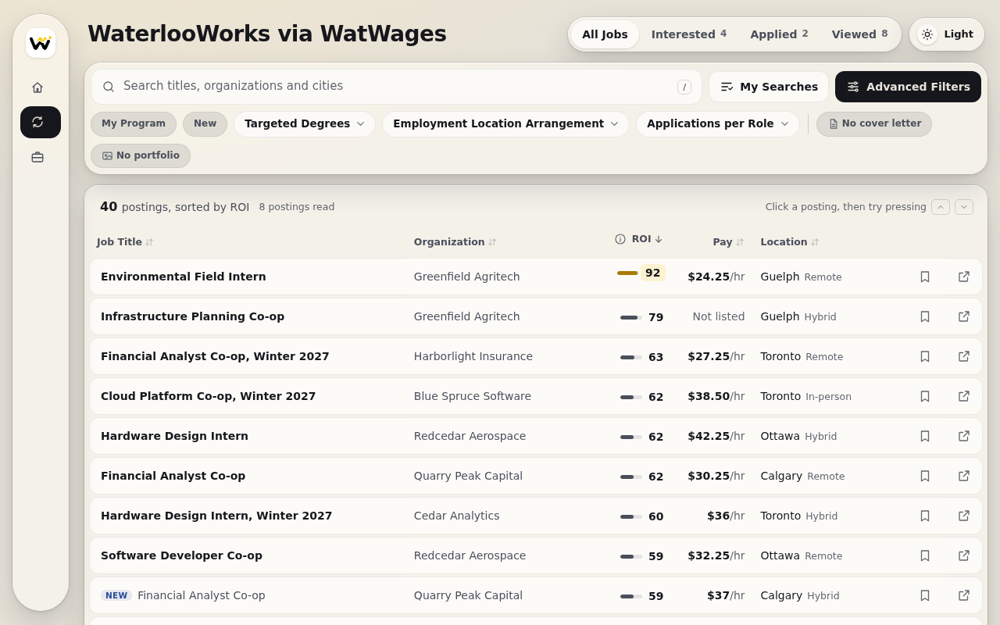
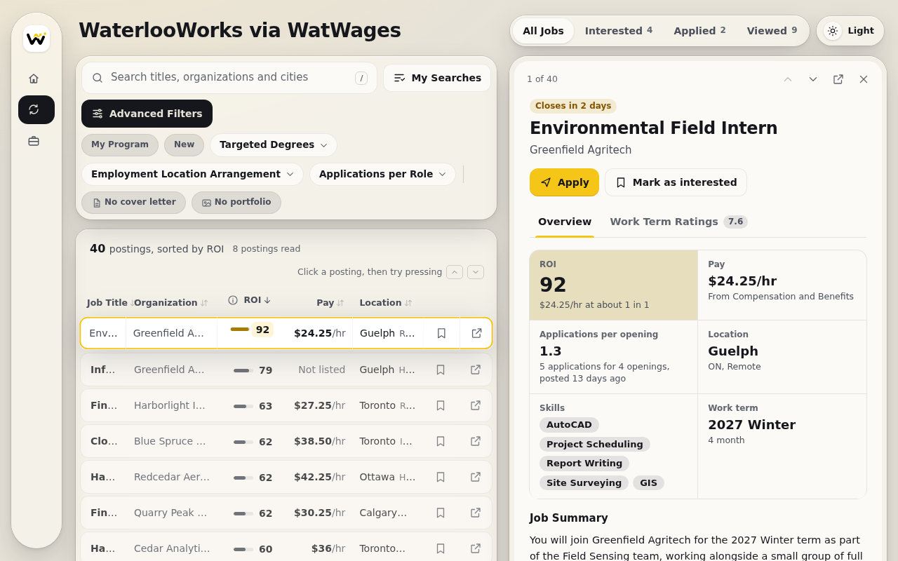
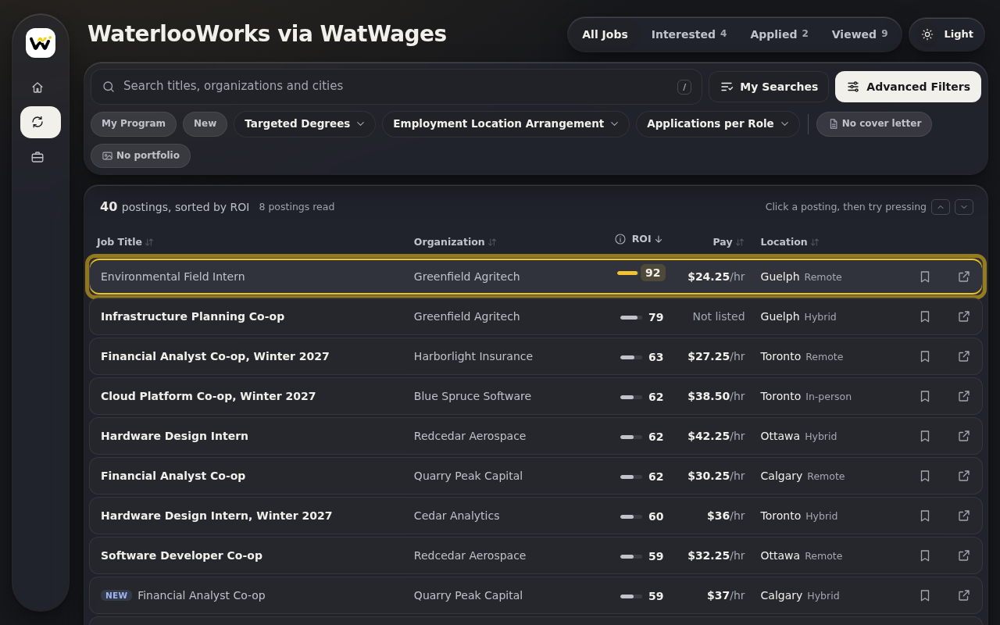

# WatsWorthIt &nbsp;

**Pay per hour and applicants per opening for every WaterlooWorks posting, on one sortable page.**

A Chrome extension for University of Waterloo co-op students.

[Chrome Web Store](https://chromewebstore.google.com/detail/watsworthit/emflchjfgkaphaafpfghkalbkmhiaccm) &nbsp;·&nbsp; [Website](https://watwages.ugmi.ca) &nbsp;·&nbsp; [Privacy policy](https://watwages.ugmi.ca/privacy/)

---

## What it does

- WaterlooWorks only shows pay at the bottom of each posting. WatsWorthIt reads every posting in your search results and puts its hourly pay in CAD on the results page, along with how many people applied per opening.
- Pay listed in USD, or per day, week, month or year, is converted to an hourly CAD rate. Hover over a number to see the sentence in the posting it came from.
- Each job gets an ROI score out of 100 that weighs the pay against your odds of getting in. The score goes down when a posting asks for a higher year of study than you have, and later roles from the same company score a little lower so one employer doesn't fill the top of your list.
- You can sort by pay, applicants per opening or ROI. Clicking a posting opens it in a side panel with how many co-op students that employer hired in past terms and which programs they came from.
- A big search takes a little while to read the first time, and a progress count shows how far along it is. After that the details are cached and the page opens right away.

## What it looks like

<table>
<tr>
<td width="50%"></td>
<td width="50%"></td>
</tr>
<tr>
<td>The results table sorted by ROI, with pay and applicants per opening next to each job.</td>
<td>A posting open in the side panel, with the employer's hiring history underneath.</td>
</tr>
<tr>
<td></td>
<td></td>
</tr>
<tr>
<td>The overlay follows your Chrome theme.</td>
<td></td>
</tr>
</table>

The screenshots use made up companies and postings.

## Install

Install WatsWorthIt from the [Chrome Web Store](https://chromewebstore.google.com/detail/watsworthit/emflchjfgkaphaafpfghkalbkmhiaccm). Then sign in to WaterlooWorks and open a job search, and the extra columns fill in as each posting is read.

## What it does with your data

This repo is public so you can read exactly what the extension does in your WaterlooWorks tab before you install it.

- It reads WaterlooWorks from inside your browser, using the session you're already logged in with. It never sees your password.
- It only runs on `waterlooworks.uwaterloo.ca` and does nothing on any other site.
- The postings it reads, your marks and your settings are saved in your browser's extension storage on your own computer. There's no account and no server of its own.
- The only thing it sends anywhere is an anonymous count: when it's installed, when it reads a job board, when you mark a posting, once a day when you use it, and once a day if WaterlooWorks changes its page and the extension can't read it. Each one carries a random install ID, the version number, the install date and your browser's language setting, never anything about a posting, a search or a setting. That code is in [`extension/src/background.js`](extension/src/background.js).

The full policy is at [watwages.ugmi.ca/privacy](https://watwages.ugmi.ca/privacy/).

## Running it from this repo

This section is for developers. Most people should use the Chrome Web Store link above, which also keeps the extension updated.

`extension/` is the same build that goes to the Chrome Web Store. Open `chrome://extensions`, turn on Developer mode, and use **Load unpacked** on the `extension/` folder. Installs loaded this way don't send the usage counts.

## License

The code is here to read, and you can use the extension for your own job search. Copying, changing or reusing it needs written permission. See [LICENSE](LICENSE).

---

WatsWorthIt is not affiliated with or endorsed by the University of Waterloo.

Made by Eric Zou. Questions go to [eric@ugmi.ca](mailto:eric@ugmi.ca).
